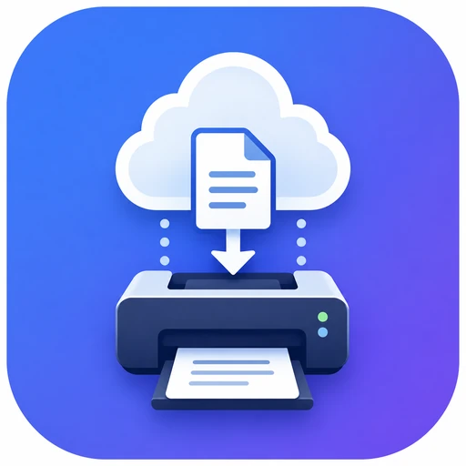

<p align="center">
  
</p>

# Cloud Print Bridge on StartOS

Cloud Print Bridge is a StartOS-native service that uses a Nextcloud folder hierarchy as a private print queue and sends supported documents to an IPP network printer.

There is no separate upstream application or web interface. The StartOS package and Cloud Print Bridge application are developed together.

## Architecture and Runtime

Cloud Print Bridge runs one Python worker inside the package's `main` image.

The worker:

- connects to the required Nextcloud service through StartOS service-to-service networking
- polls `Cloud Print/Inbox` using WebDAV
- atomically claims jobs by moving them to `Processing`
- converts Office/OpenDocument and text files to PDF when required
- converts PDF-based jobs to PWG Raster
- submits printer jobs over IPP
- moves confirmed jobs to `Printed`
- moves failed or unconfirmed jobs to `Failed` without automatic retry

No Nextcloud LAN IP, `.local` hostname, onion address, or user-entered Nextcloud URL is required. StartOS supplies the internal bridge address and HTTP host identity at runtime.

The service exposes no user-facing network interface or port.

## Volumes

| Volume | Mount | Purpose |
| --- | --- | --- |
| `main` | `/data` | Stores Cloud Print Bridge configuration. |

The print queue itself remains in Nextcloud and is not stored in the Cloud Print Bridge volume.

## Actions

### Configure Cloud Print Bridge

Configures:

- Nextcloud username and app password
- printer mode
- manual/fallback IPP URL
- IPv4 printer-discovery network or networks
- persistent printer UUID
- paper size
- color or monochrome printing
- one-sided, duplex long-edge, or duplex short-edge printing
- copy count
- Inbox polling interval

### Discover Printers

The **Discover Printers** action scans one or more IPv4 networks for
reachable IPP printers. It does not require a printer UUID in advance.

For each discovered printer, the action displays its advertised printer
name, persistent IPP UUID, and usable IPP URI. The UUID and URI are
copyable from the StartOS action result.

Use this action during first-time setup to learn the UUID of the printer
you want Cloud Print Bridge to track.

## Printer Modes

### Manual IPP URL

Cloud Print Bridge sends jobs to the configured IPP URL.

### Locate Printer by UUID

After using **Discover Printers** to obtain the desired printer's
persistent UUID, Cloud Print Bridge can search one or more configured
IPv4 networks for that UUID. This allows the same physical printer to be
located again after its IP address changes.

A manual IPP URL may also be retained as a fallback or last-known address.

## Supported Formats

- PDF
- TXT
- JPG, JPEG, PNG, BMP, TIF, TIFF, WebP
- DOC, DOCX, ODT, RTF
- XLS, XLSX, ODS
- PPT, PPTX, ODP

LibreOffice performs Office/OpenDocument conversion. Ghostscript performs PDF normalization and PDF-to-PWG-Raster conversion. ReportLab renders TXT jobs. Pillow handles supported image formats.

## PDF Page Selection

Native PDF jobs can select pages using a filename directive:

```text
Report [pages=8].pdf
Report [pages=3-4].pdf
Report [pages=1-3,8,12-15].pdf
```

Selections must be positive, strictly ascending, and non-overlapping.

Cloud Print Bridge first creates a temporary normalized PDF containing only the requested pages, then sends that complete temporary document through the same full-document PWG Raster path used by ordinary PDFs. This preserves correct duplex page orientation.

Invalid, reversed, overlapping, out-of-order, or out-of-range selections fail without printing.

## Queue Safety

The expected Nextcloud folders are:

```text
Cloud Print/
├── Inbox/
├── Processing/
├── Printed/
└── Failed/
```

The normal flow is:

```text
Inbox -> Processing -> Printed
```

A definite failure or an outcome that cannot be safely confirmed moves the source to `Failed`. Cloud Print Bridge does not automatically retry uncertain printer outcomes because some pages or copies may already have printed.

On service startup, pre-existing files in `Processing` are treated as orphaned/unconfirmed jobs and moved to `Failed` without printing.

## Resource Guards

- maximum source file size: 100 MiB
- maximum PDF page count: 200
- maximum combined printer-discovery scan: 4096 unique IPv4 hosts
- printer upload uses streamed IPP transfer rather than constructing one giant HTTP request

## Backups

StartOS backs up the `main` volume using a normal volume snapshot. The service is stopped during backup and restored using the same volume.

Nextcloud queue contents are backed up by Nextcloud's own backup strategy, not by Cloud Print Bridge.

## Health and Readiness

The `main` daemon has an internal readiness check. The Python worker creates its readiness marker after it reaches its configured/operational startup state.

Cloud Print Bridge currently defines no separate user-visible standalone health checks.

The required Nextcloud dependency is declared as running and references Nextcloud's `nextcloud` health check. Dependency state drives StartOS warnings but does not replace Cloud Print Bridge's runtime retry behavior.

## Dependencies

### Nextcloud

Nextcloud is required and provides the WebDAV print queue. Cloud Print Bridge resolves Nextcloud through the StartOS host bridge at service startup.

## Limitations and Differences

1. Printer discovery and UUID-based location currently scan IPv4 only.
2. The printer must be reachable from the StartOS server over IPP.
3. PDF filename page-selection directives apply only to native PDF jobs.
4. Office conversion fidelity depends on LibreOffice and the fonts installed in the Cloud Print Bridge image.
5. A job moved to `Failed` after an uncertain printer result must be checked physically before manual retry.
6. Cloud Print Bridge has no web UI; normal operation uses Nextcloud folders, the Configure and Discover Printers actions, and StartOS logs.

## Build

Development follows the current StartOS packaging toolchain.

```bash
npm ci
python3 -m py_compile app/worker.py
npx tsc --noEmit
make x86
```

For the declared ARM build:

```bash
make arm
```

Do not run `make clean` unless removal of generated build dependencies is intentional.

## Licensing

The package manifest uses `AGPL-3.0-only`, reflecting the most restrictive major runtime component distributed in the image, Ghostscript. See `LICENSE` and `THIRD_PARTY_NOTICES.md`.

---

## Quick Reference for AI Consumers

```yaml
package_id: cloud-print-bridge
architectures: [x86_64, aarch64]
volumes:
  main: /data
ports: none
interfaces: none
dependencies:
  - nextcloud
startos_managed_env_vars:
  - NEXTCLOUD_BRIDGE_ADDRESS
  - NEXTCLOUD_HOST_HEADER
actions:
  - configure
  - discover-printers
queue_folders:
  - Cloud Print/Inbox
  - Cloud Print/Processing
  - Cloud Print/Printed
  - Cloud Print/Failed
printer_modes:
  - manual
  - uuid-discovery
source_file_limit_mib: 100
pdf_page_limit: 200
```
